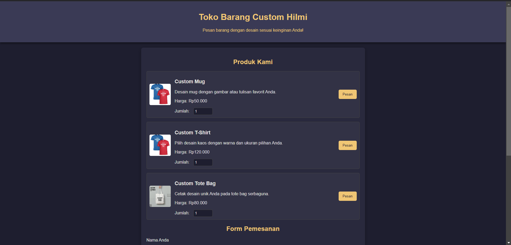

# PROJECT-OS-SERVER-&-SYSTEM-ADMIN
Tema : Web Server Jual Jasa Custom

## Dibuat
- M. Ardita Hilmi (23.83.0981)

## Spesifikasi Ubuntu Server
- RAM 8 GB
- Storage 15 GB
- Ubuntu Server 24.04.1

## Layanan yang digunakan
| Jenis Layanan           | Layanan Server           |
| :--------               | :-------                 |
| `Web Server`            | `Apache2`                |
| `Database Server`       | `MySQL`                  |
| `SSH Server`            | `OpenSSH`                |
| `Data Structure Server` | `Redis  `                |
| `Monitoring`            | ` Grafana`               |

## Langkah-Langkah
## Langkah-Langkah
## 1.OpenSSH
 

### Install OpenSSH
```bash
sudo apt update && sudo apt install openssh-server  -y
```
### Memulai layanan SSH
```bash
sudo service ssh start
```
### Melihat status layanan SSH
```bash
sudo service ssh status
```
### Menginstal net-tools
```bash
sudo apt install net-tools -y
```

## 2. Apache2
 

### Memperbarui dan Install Apache2
```bash
sudo apt update && sudo apt install apache2  -y
```
### cek status Apache2
```bash
sudo service apache2 status
```
### cek available aplikasi Apache2
```bash
sudo ufw app list
```
### port Apache2
```bash
sudo ufw app info "Apache Full"
```
### cek status Apache2
```bash
sudo ufw status
```

## 3. MySQL dan PHP
 

### Install MySQL dan server
```bash
sudo apt install php libapache2-mod-php php-mysql mysql-server -y 
```
### Install phpmyadmin -y
```bash
sudo apt install phpmyadmin -y
```
### Package configuration
 
 
 

### PHP file
```bash
 sudo nano /etc/apache2/mods-enabled/dir.conf
```


### Edit info.php
```bash
 sudo nano /var/www/html/info.php
```


### Konfigurasi Koneksi Database
```bash
 sudo nano /etc/phpmyadmin/config-db.php
```


### Membuat symlink ke folder phpMyAdmin
```bash
sudo ln -s /usr/share/phpmyadmin /var/www/html/phpmyadmin
```

### Masuk mysql
```bash
sudo mysql -u root -p
```


## 4. Redis
 

### Install redis
```bash
sudo apt install php-redis -y 
```
### edit redis.conf
```bash
sudo nano /etc/redis.conf
```


### Package configuration
 
 
 

### restart
```bash
 sudo systemctl restart redis.service
```

### status redis
```bash
 sudo systemctl status redis
```


### masuk redis-cli
```bash
 redis-cli
```


### restart lagi
```bash
 sudo systemctl restart redis.service
```

### port yang sedang mendengarkan
```bash
 sudo netstat -lnp | grep redis
```

### buka edit redis.conf
```bash
sudo nano /etc/redis.conf
```
### buka edit redis.conf
tambahkan ini :


### masuk submit_order.php
```bash
sudo nano /var/www/html/submit_order.php
```
### buka edit submit_order.php
tambahkan ini :


### Masuk mysql
```bash
sudo mysql -u root -p
```


## 5. Install Grafana
 

### Install grafana
```bash
sudo apt install -y software-properties-common
sudo add-apt-repository "deb https://packages.grafana.com/oss/deb stable main"
wget -q -O - https://packages.grafana.com/gpg.key | sudo apt-key add -
sudo apt update
sudo apt install grafana
```

### mulai grafana
```bash
sudo systemctl start grafana-server
sudo systemctl enable grafana-server
```
## 6. Demo


